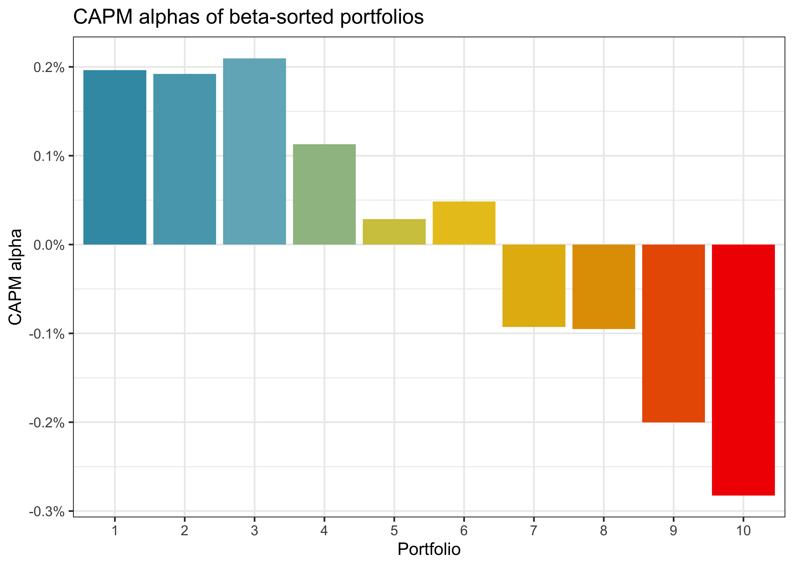
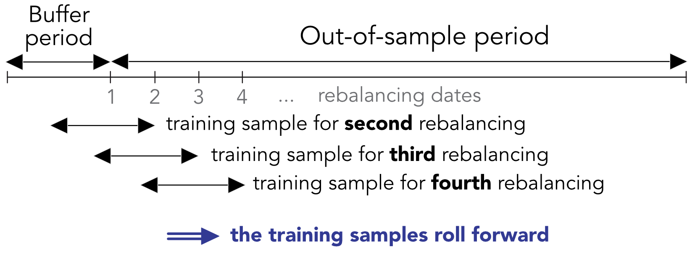

# Asset prices and returns

## Asset prices and returns

**Topics** 

- Stock market returns
- Optimal portfolio choice
- Diversification and risk management
- The Capital asset pricing model 
- Accessing financial data
- Portfolio backtesting

## General framework and notation

- We consider $N$ assets and time-series of prices $P_{t,i}$ of asset $i$ at time $t$
- Net returns are $r_{t+1, i} := (P_{t+1, i} - P_{t, i})/P_{t, i}$, gross returns are $R_{t+1, i} := P_{t+1, i}/P_{t, i} =  1 + r_{t+1, i}$, log returns are $\tilde r_{t+1, i} := \log(P_{t+1, i}) - \log(P_{t, i})$
- Dividends modify the definitions, e.g., $\tilde r_{t+1} = \log(P_{t+1, i} + D_{t+1,i}) - \log(P_{t, i})$

::: {.panel-tabset}
### R
```{r}
#| echo: false
#| warning: false
library(tidyverse)
library(tidyfinance)
library(ggrepel)
library(scales)
```

```{r}
library(tidyverse)
library(tidyfinance)

symbols <- download_data(
  type = "constituents",
  index = "Dow Jones Industrial Average"
)

prices_daily <- download_data(
    type = "stock_prices", symbol = symbols$symbol,
    start_date = "2019-08-01", end_date = "2026-01-15"
) |> 
  select(symbol, date,  price = adjusted_close)

returns_monthly <- prices_daily |>
  mutate(date = floor_date(date, "month")) |>
  group_by(symbol, date) |>
  summarize(price = last(price), .groups = "drop_last") |>
  mutate(ret = price / lag(price) - 1) |>
  drop_na(ret) |>
  select(-price)
```

### Python
```{python} 
#| eval: false
import pandas as pd
import numpy as np
import tidyfinance as tf

symbols = tf.download_data(
  domain="constituents", 
  index="Dow Jones Industrial Average"
)

prices_daily = tf.download_data(
  domain="stock_prices", 
  symbols=symbols["symbol"].tolist(),
  start_date="2000-01-01", 
  end_date="2025-01-15"
)

returns_monthly = (prices_daily
  .assign(date=prices_daily["date"].dt.to_period("M").dt.to_timestamp())
  .groupby(["symbol", "date"], as_index=False)
  .agg(adjusted_close=("adjusted_close", "last"))
  .assign(ret=lambda x: x.groupby("symbol")["adjusted_close"].pct_change())
)
```

:::

## Distributional properties of returns

**Moments of the return distribution**

- Define $\mu = E(r_{t+1})$ and $\Sigma = \text{Cov}(r_{t+1}) = E((r_{t+1} - \mu)(r_{t+1} - \mu)')$
- Volatility $\sigma$ is the standard deviation (the square root of the variance $\sigma^2$)    

- **Later:** $\mu_{\color{red}{t}} := E(r_{t+1}|\mathcal{F}_t)$ and $\Sigma_{\color{red}{t}} = \text{Cov}(r_{t+1}|\mathcal{F}_t)$ where $\mathcal{F}_t$ denotes the available information at $t$

**Sample moments**

- Suppose you have $T$ observations of the $(N\times1)$ vector, $r_1, \ldots, r_{t}, \ldots, r_T$
- The sample counterparts $\hat{\mu}$ and $\hat{\Sigma}$ are
$$
\hat\mu = \frac{1}{T}\sum\limits_{t=1}^Tr_t \qquad \hat{\Sigma} = \frac{1}{T-1}\sum\limits_{t=1}^T\left((r_t - \hat{\mu})(r_t - \hat{\mu})'\right)
$$

## Distributional properties of returns

::: {.panel-tabset}

## R

```{r}
assets <- returns_monthly |> 
  group_by(symbol) |> 
  summarize(
    mu = mean(ret),
    sigma = sd(ret)
  )
```

## Python

```{python}
#| eval: false
assets = (returns_monthly
  .groupby("symbol", as_index=False)
  .agg(
    mu=("ret", "mean"),
    sigma=("ret", "std")
  )
)
```

## Figure {.active}

```{r}
#| echo: false

library(ggrepel)
library(scales)

theme_set(theme_minimal())

assets |> 
  ggplot(aes(x = sigma, y = mu, label = symbol)) +
  geom_point() +
  ggrepel::geom_text_repel() +
  scale_x_continuous(labels = percent) +
  scale_y_continuous(labels = percent) +
  labs(
    x = "Volatility", y = "Expected return",
    title = "Expected returns and volatilities of Dow Jones index constituents"
  )
```

:::


# Optimal portfolio allocation

## Optimal (static) portfolio choice
- **Aim:** Choose $(N \times 1)$ vector $\omega$ such that $\sum\limits_{t=1}^T \omega_i = \iota'\omega = 1$ where $\iota$ is an $(N\times 1)$ vector of ones
- Portfolio returns $r^{pf}_{t} = \omega'r_t$
- Common properties of utility functions (concave) 
$$
U'(r_t) > 0 \text{ and } U(E(r_t)) > E(U(r_t))
$$ 

- Preference for higher expected return and lower volatility $\sigma^{pf} =\sqrt{\text{Var}\left(r^{pf}_t\right)}$

$$\begin{aligned}
E(r^{pf}_{t}) = \omega'\mu \qquad (\sigma^{pf})^2 &= E\left(\omega'(r_t - \mu)(r_t- \mu)'\omega\right) \\ &= E\left(tr\left(\omega'(r_t - \mu)(r_t- \mu)'\omega\right)\right)
\\ &= tr\left(\omega'E\left((r_t - \mu)(r_t- \mu)\right)'\omega\right) = \omega'\Sigma \omega
\end{aligned}
$$

## Minimum variance portfolio
- The minimum variance portfolio weights are given by the solution to 
$$
\omega_\text{mvp} = \arg\min \omega'\Sigma \omega \text{ s.t. } \iota'\omega= 1
$$

- The Lagrangian reads 
$$
\mathcal{L}(\omega) = \omega'\Sigma \omega - \lambda(\omega'\iota - 1)
$$

- Analytic solution by solving the first-order conditions of the Lagrangian equation
$$
\begin{aligned}
& \frac{\partial\mathcal{L}(\omega)}{\partial\omega} = 0 \Leftrightarrow 2\Sigma \omega = \lambda\iota \Rightarrow \omega = \frac{\lambda}{2}\Sigma^{-1}\iota \\ \end{aligned}
$$

- Constraint delivers: $1 = \iota'\omega = \frac{\lambda}{2}\iota'\Sigma^{-1}\iota \Rightarrow \lambda = \frac{2}{\iota'\Sigma^{-1}\iota}$
$$
\begin{aligned}
\Rightarrow &\omega_\text{mvp} = \frac{\Sigma^{-1}\iota}{\iota'\Sigma^{-1}\iota}
\end{aligned}
$$

- Variance of the minimum variance portfolio return is $\omega_\text{mvp}'\Sigma \omega_\text{mvp} = \frac{1}{\iota'\Sigma^{-1}\iota}$

## Computing the minimum variance portfolio
- Suppose you know the variance-covariance matrix $\Sigma$

::: {.panel-tabset}
### R 
```{r}
sigma <- returns_monthly |> pivot_wider(names_from = symbol, values_from = ret) |> select(-date) |> cov()
sigma_inv <- solve(sigma)
iota <- rep(1, ncol(sigma))
omega_mvp <- sigma_inv %*% iota
omega_mvp <- omega_mvp / sum(omega_mvp)
```

### Python
```{python}
#| eval: false
import numpy as np
sigma = (returns_monthly
  .pivot(index="date", columns="symbol", values="ret")
  .reset_index()
  .drop(columns=["date"])
  .cov()
)

iota = np.ones(sigma.shape[0])
sigma_inv = np.linalg.inv(sigma.values)
omega_mvp = (sigma_inv @ iota) / (iota @ sigma_inv @ iota)
```

:::

- Which practical issue is important here?

## The efficient portfolio
- Consider an investor who aims to achieve minimum variance *given a desired expected return* $\bar{\mu}$
$$
\omega_\text{eff}\left(\bar{\mu}\right) = \arg\min \omega'\Sigma \omega \text{ s.t. } \iota'\omega = 1 \text{ and } \omega'\mu \geq \bar{\mu}
$$

- The Lagrangian reads 
$$
\mathcal{L}(\omega) = \omega'\Sigma \omega - \lambda(\omega'\iota - 1) - \tilde{\lambda}(\omega'\mu - \bar{\mu})
$$

- Solve the first-order conditions
$$
\begin{aligned}
2\Sigma \omega &= \lambda\iota + \tilde\lambda \mu\\
\omega &= \frac{\lambda}{2}\Sigma^{-1}\iota + \frac{\tilde\lambda}{2}\Sigma^{-1}\mu
\end{aligned}
$$

## The efficient portfolio
- The two constraints ($\omega'\iota = 1 \text{ and } \omega'\mu \geq \bar{\mu}$) imply 
$$
\begin{aligned}
1 &= \iota'\omega = \frac{\lambda}{2}\underbrace{\iota'\Sigma^{-1}\iota}_{C} + \frac{\tilde\lambda}{2}\underbrace{\iota'\Sigma^{-1}\mu}_D
\Rightarrow \lambda = \frac{2 - \tilde\lambda D}{C}\\
\bar\mu &= \mu'\omega = \frac{\lambda}{2}\underbrace{\mu'\Sigma^{-1}\iota}_{D} + \frac{\tilde\lambda}{2}\underbrace{\mu'\Sigma^{-1}\mu}_E = \frac{1}{2}\left(\frac{2 - \tilde\lambda D}{C}\right)D+\frac{\tilde\lambda}{2}E  \\&=\frac{D}{C}+\frac{\tilde\lambda}{2}\left(E - \frac{D^2}{C}\right)\\
\Rightarrow \tilde\lambda &= 2\frac{\bar\mu - D/C}{E-D^2/C}\\
\end{aligned}
$$

- As a result, the efficient portfolio weight takes the form (for $\bar{\mu} \geq D/C = \mu'\omega_\text{mvp}$)
$$
\omega_\text{eff}\left(\bar\mu\right) = \omega_\text{mvp} + \frac{\tilde\lambda}{2}\left(\Sigma^{-1}\mu -\frac{D}{C}\Sigma^{-1}\iota \right)
$$

## The efficient portfolio
- Note that 
$$
\iota'\left(\Sigma^{-1}\mu -\frac{D}{C}\Sigma^{-1}\iota \right) = D - D = 0\text{ so }\iota'\omega_\text{eff} = \iota'\omega_\text{mvp} = 1
$$

and 
$$
\mu'\omega_\text{eff} = \frac{D}{C} + \bar\mu - \frac{D}{C} = \bar\mu
$$

- The efficient portfolio allocates wealth in the minimum variance portfolio $\omega_\text{mvp}$ and a levered (self-financing) portfolio to increase the expected return

## The efficient frontier

- Assume you computed $\omega_\text{eff}(\bar\mu)$ and $\omega_\text{eff}(\tilde\mu)$ for $\bar\mu > \tilde \mu \geq D/C$, then any linear combination with $c\in\mathbb{R}_+$ can be represented as  
$$
\omega^* = c\omega_\text{eff}(\bar\mu) + (1-c)\omega_\text{eff}(\tilde\mu) = \omega_\text{mvp} + \frac{\lambda^*}{2}\left(\Sigma^{-1}\mu -\frac{D}{C}\Sigma^{-1}\iota \right)
$$ 

with $\lambda^* = 2\frac{c\bar\mu + (1-c)\tilde\mu - D/C}{E-D^2/C}$.

- [Mutual fund separation theorem](https://en.wikipedia.org/wiki/Mutual_fund_separation_theorem): any **linear combination** of efficient portfolios is also efficient

$$\omega_{eff} = a \cdot \omega_{efp} + (1-a) \cdot\omega_{mvp}$$

- Highest achievable expected return at each level of risk

## The efficient frontier 

::: {.panel-tabset}

### R 
```{r}
mu_bar <- max(assets$mu)
C <- as.numeric(t(iota) %*% sigma_inv %*% iota)
D <- as.numeric(t(iota) %*% sigma_inv %*% assets$mu)
E <- as.numeric(t(assets$mu) %*% sigma_inv %*% assets$mu)
lambda_tilde <- as.numeric(2 * (mu_bar - D / C) / (E - D^2 / C))
omega_efp <- as.vector(omega_mvp + lambda_tilde / 2 * (sigma_inv %*% assets$mu - D * omega_mvp))

summary_efp <- tibble(
  mu = as.numeric(t(omega_efp) %*% assets$mu),
  sigma = as.numeric(sqrt(t(omega_efp) %*% sigma %*% omega_efp)),
  type = "Efficient Portfolio"
)

efficient_frontier <- tibble(a = seq(from = -0, to = 2, by = 0.01)) |> 
  mutate(
    omega = map(a, \(x) x * omega_efp + (1 - x) * omega_mvp),
    mu = map_dbl(omega, \(x) t(x) %*% assets$mu),
    sigma = map_dbl(omega, \(x) sqrt(t(x) %*% sigma %*% x)),
  ) 

```

### Python
```{python}
#| eval: false
mu_bar = assets["mu"].max()
C = iota @ sigma_inv @ iota
D = iota @ sigma_inv @ mu
E = mu @ sigma_inv @ mu
lambda_tilde = 2 * (mu_bar - D / C) / (E - (D ** 2) / C)
omega_efp = omega_mvp + (lambda_tilde / 2) * (sigma_inv @ mu - D * omega_mvp)
mu_efp = omega_efp @ mu
sigma_efp = np.sqrt(omega_efp @ sigma.values @ omega_efp)

summary_efp = pd.DataFrame({
  "mu": [mu_efp],
  "sigma": [sigma_efp],
  "type": ["Efficient Portfolio"]
})

efficient_frontier = (
  pd.DataFrame({
    "a": np.arange(-1, 2.01, 0.01)
  })
  .assign(omega=lambda x: x["a"].map(lambda x: x * omega_efp + (1 - x) * omega_mvp))
  .assign(
    mu=lambda x: x["omega"].map(lambda x: x @ mu),
    sigma=lambda x: x["omega"].map(lambda x: np.sqrt(x @ sigma @ x))
  )
)
```

### Figure {.active}
```{r}
#| echo: false
summaries <- bind_rows(assets, efficient_frontier) 
summaries |> 
  ggplot(aes(x = sigma, y = mu)) +
  geom_point(
    data = summaries |> filter(is.na(a))
  ) +
  geom_point(
    data = summaries |> filter(!is.na(a)), size = 0.1) +
  scale_x_continuous(labels = percent) +
  scale_y_continuous(labels = percent) + 
  labs(x = "Volatility", y = "Expected return",
       title = "Efficient frontier from historical moments of Dow Jones index constituents") + 
  theme(legend.position = "none")

```

::: 

## The efficient frontier with a risk-free rate

- portfolio weight vector $\omega\in\mathbb{R}^N$ which denotes investments into the available $N$ risky assets. 
- **Now: ** Instead of $\sum_i^N \omega_i=1$, assume that all the remaining wealth, $1-\iota'\omega$, is invested in a risk-free asset which pays a constant interest $r_f > 0$
- The expected portfolio return for the portfolio of risky assets $\omega$ is then
$$
\mu_\omega = \omega^{\prime}\mu + (1-\iota^{\prime}\omega)r_f = r_f + \omega^{\prime}\underbrace{(\mu-r_f)}_{\tilde\mu}
$$

- We refer to $\tilde\mu$ as the vector of expected *excess* returns. 
- the volatility of the portfolio is given by
$$
\sigma_\omega = \sqrt{\omega^{\prime}\Sigma\omega}
$$

## Optimal decision problem
- earn a desired level of expected portfolio (excess) returns ($\bar\mu-r_f$) with the lowest possible variance leads to
$$
\min_\omega Z(\omega) = \min_\omega \omega^{\prime}\Sigma\omega - \lambda \left(\omega^{\prime}\tilde\mu-\bar\mu\right).
$$

- The first-order conditions for this optimization problem yield:
$$
\frac{\partial Z}{\partial \omega} = 2\Sigma\omega - \lambda \tilde\mu = 0 \Leftrightarrow \omega^* = \frac{\lambda}{2}\Sigma^{-1}\tilde\mu
$$

- The constraint $\omega^{\prime}\tilde\mu_\omega\geq \bar\mu$ delivers 
$$
\bar\mu = \tilde\mu^{\prime}\omega^* = \frac{\lambda}{2}\tilde\mu^{\prime}\Sigma^{-1}\tilde\mu 
\Rightarrow \lambda = \frac{2\bar\mu}{\tilde\mu^{\prime}\Sigma^{-1}\tilde\mu}.
$$

- the optimal portfolio weights are given by 
$$
\omega^* = \frac{\bar\mu}{\tilde\mu^{\prime}\Sigma^{-1}\tilde\mu}\Sigma^{-1}\tilde\mu \Rightarrow \omega_\text{tan} := \frac{\omega^*}{\iota'\omega^*}= \frac{\Sigma^{-1}(\mu-r_f)}{\iota^{\prime}\Sigma^{-1}(\mu-r_f)}.
$$

- Why does $\bar\mu$ not show up in $\omega_{tgc}$?

## Compute the efficient tangency weight

:::{.panel-tabset group="language"}
### R
```{r}
rf <- 0
w_tan <- solve(sigma) %*% (assets$mu - rf)
w_tan <- w_tan / sum(w_tan)

mu_w <- as.numeric(t(w_tan) %*% assets$mu)
sigma_w <- as.numeric(sqrt(t(w_tan) %*% sigma %*% w_tan))

efficient_portfolios <- tribble(
  ~symbol,    ~mu,         ~sigma,
  "omega[tan]", mu_w, sigma_w,
  "r[f]", rf,   0
)

sharpe_ratio <- (mu_w - rf) / sigma_w
```

### Python 
```{python}
#| eval: false
rf = 0
w_tan = np.linalg.solve(sigma, mu - rf)
w_tan = w_tan / np.sum(w_tan)

mu_w = w_tan.T @ mu
sigma_w = np.sqrt(w_tan.T @ sigma @ w_tan)

efficient_portfolios = pd.DataFrame([
  {"symbol": "\omega_{tan}", "mu": mu_w, "sigma": sigma_w},
  {"symbol": "r_f", "mu": rf, "sigma": 0}
])

sharpe_ratio = (mu_w - rf) / sigma_w
```

### Figure {.active}
```{r}
#| echo: false
assets |> 
  ggplot(aes(x = sigma, y = mu)) +
  geom_point() + 
  geom_line(
    data = summaries |> filter(!is.na(a)), linewidth = 0.5,
    linetype = "dotted") + 
  geom_point(data = efficient_portfolios, color = "blue") +
  geom_label_repel(data = efficient_portfolios,
                   aes(label = symbol), parse = TRUE) +
  scale_x_continuous(labels = percent) +
  scale_y_continuous(labels = percent) +
  labs(
    x = "Volatility", y = "Expected return",
    title = "The efficient frontier with a risk-free asset and Dow index constituents"
  ) +
  geom_abline(aes(intercept = rf, slope = sharpe_ratio))
```
::: 

## The security market line

- Taking another look at the efficient tangency portfolio $\omega_\text{tan}$ reveals that expected asset excess returns $\tilde\mu$ cannot be arbitrarily large or small
- From the first order condition of the optimization problem above we get
$$
\frac{\partial Z}{\partial \omega} = 2\Sigma\omega - \lambda \tilde\mu =0 \\\Leftrightarrow \tilde\mu = \frac{2}{\lambda}\Sigma\omega^* = \frac{2}{\lambda}\underbrace{\iota'\omega^*}_{=\frac{\lambda}{2}\iota^{\prime}\Sigma^{-1}\tilde\mu}\Sigma\omega_\text{tan} \\ = \iota^{\prime}\Sigma^{-1}\tilde\mu\Sigma\omega_\text{tan}
$$

- Putting everything together yields for the expected excess return of asset $i$: 

$$
\tilde{\mu}_i = \frac{E(\omega_\text{tan}^{\prime}r - r_f)}{\sigma_{\text{tan}}^2} \text{Cov}\left(r_i,r_\text{tan}\right) = \beta_i \tilde{\mu}_\text{tan}.
$$

## Computing the security market line

:::{.panel-tabset}
### R
```{r}
betas <- (sigma %*% w_tan) / as.numeric(t(w_tan) %*% sigma %*% w_tan)
assets <- assets |> 
  mutate(beta = betas)

price_of_risk <- as.numeric(t(w_tan) %*% assets$mu - rf)
```

### Python
```{python}
#| eval: false
betas = (sigma @ w_tan) / (w_tan.T @ sigma @ w_tan)
assets["beta"] = betas.values

price_of_risk = float(w_tan.T @ mu - rf)
```

### Figure {.active}
```{r}
#| echo: false
assets |> 
  ggplot(aes(x = beta, y = mu)) +
  geom_point()  + 
  ggrepel::geom_text_repel(aes(label = symbol), max.overlaps = Inf) +
  geom_abline(intercept = rf, slope = price_of_risk) +
  scale_y_continuous(labels = percent) +
  labs(
    x = "Beta", y = "Expected return",
    title = "Security market line"
  ) +
  geom_label_repel(data = tibble(beta = 0, mu = rf), aes(label = "Risk-free"))

```
::: 

## How to estimate betas in practice?

Calculating the **tangency portfolio** can be **cumbersome**

- What is the correct asset universe?
- How to estimate $\mu$ and $\Sigma$ for many assets?

<br>

In the CAPM: **market portfolio = tangency portfolio**

- Skip calculation of tangency portfolio weights
- Use portfolios weighted by market capitalization

## Capital asset pricing model

- **If** all investors share beliefs about $\Sigma$ and $\mu$ **and** can borrow and invest without limits  at $r_f$, **everybody** invests a fraction of her wealth in $\omega_\text{tgc}$ and in the risk-free rate (two mutual fund theorem) 
- The tangency portfolio is the market portfolio $\omega_\text{m}$ and the individual weights of asset $i$ are just 
$$
\omega_\text{tgc, i} = \omega_\text{m, i} = \frac{P_iSCO_i}{\sum\limits_{j=1}^N P_jSCO_j}
$$

 where $SCO_j$ is the number of shares outstanding of a stock $i$.
- To align the two results, the capital asset pricing model imposes constraints for the expected return of stock $i$

$$
E(r_i) - r_f = \underbrace{\frac{Cov(r_i, r_m)}{\text{Var}(r_m)}}_{\beta_i} E(r_m - r_f)
$$

- Expected returns are entirely determined by the price of risk (market risk premium) and the comovement of asset $i$ with the market, $\beta_i$.

## Assumptions behind CAPM

- Equilibrium model in a single-period economy
-	No transaction costs or taxes
-	Risk-free borrowing and lending are available to all investors
-	Investors share homogeneous expectations
-	Investors maximize returns for limited level of risk

<br>

CAPM is a **foundation for other models** because of its simplicity

## The Security Market Line (SML)

**Expected return of asset** $i$ is

$$\mu_i =  r_f + \beta_i \cdot (\mu_m - r_f)$$

where

$$\beta_i = \frac{\sigma_{im}}{\sigma_m^2}$$

- $\mu_m$: expected market returns
- $\sigma_{im}$: covariance of asset $i$ with market
- $\sigma_m$: market volatility

## The market factor 

- The market risk premia is the market excess return $z_t = r_{m,t} - r_{f,t}$ 
- We proxy for the market as the value-weighted portfolio of all US-based common stocks in CRSP 
- This aggregation is already provided by Kenneth French on his homepage
- Sharpe ratio is computed as $\frac{\hat{\mu_z}}{\hat{\sigma}_z}$

```{r}
#| echo: false
library(arrow)
library(gt)
factors_ff_monthly <- read_parquet("../data-r/factors_ff3_monthly.parquet")
factors_ff_monthly |> 
    mutate(mkt_excess = 100 * mkt_excess) |> 
    summarise(across(mkt_excess, list(mean = ~ 12 * mean(.), 
                                      "\u03C3̂" = ~sqrt(12) * sd(.), 
                                      Sharpe = ~sqrt(12) * mean(.)/sd(.)),
                     .names = "{.fn}")) |>
                      gt() |>
  fmt_number(columns = everything(), decimals = 2) |> 
  tab_footnote(
    footnote = "All values are annualized.")
```

## Regression specification of stock

$$
r_{i,t} - r_{f,t} = \alpha_i + \underbrace{\frac{Cov(r_i, r_m)}{\text{Var}(r_m)}}_{\beta_i} (r_{m,t} - r_{f,t}) + \varepsilon_{i, t}
$$

- For the econometric analysis of the model, we assume that innovations $\varepsilon_{i, t}$ are independently and identically distributed (IID) through time and jointly multivariate normal
- Expected returns are entirely determined by the price of risk (market risk premium) and the co-movement of asset $i$ with the market, $\beta_i$
- To determine whether the portfolio/asset generates abnormal returns relative to the CAPM risk model, we evaluate whether the fitted intercept coefficient $\alpha_i$, which serves as the estimate of the average abnormal return per period, is statistically distinguishable from zero
- \textcolor{red}{Discuss:} What are the questionable assumptions behind the baseline regression framework? 

## CAPM - Example with simple linear regression
```{r}
#| echo: false
library(broom)
apple_monthly <- returns_monthly |> filter(symbol == "AAPL") |> 
  left_join(factors_ff_monthly |> select(date, rf, mkt_excess), join_by(date)) |>
  mutate(ret_excess = ret - rf)
capm_regression <- lm(ret_excess ~ mkt_excess, data = apple_monthly)
coef_tbl   <- tidy(capm_regression)
fit_stats  <- glance(capm_regression)

alpha <- coef_tbl$estimate[coef_tbl$term == "(Intercept)"]
beta  <- coef_tbl$estimate[coef_tbl$term == "mkt_excess"]
r2    <- fit_stats$r.squared

# Choose a representative market move for illustrating beta
dx <- quantile(apple_monthly$mkt_excess, 0.9, na.rm = TRUE)

ggplot(apple_monthly, aes(x = mkt_excess, y = ret_excess)) +
  geom_point(alpha = 0.5, size = 1.6) +

  # Full CAPM fit (context only)
  geom_abline(
    intercept = alpha,
    slope = beta,
    linewidth = 0.8,
    alpha = 0.4
  ) +

  # Alpha: horizontal line
  geom_hline(
    yintercept = alpha,
    linetype = "dashed",
    linewidth = 1
  ) +

  # Beta: rise-over-run segment from the origin
  geom_segment(
    x = 0, y = 0,
    xend = dx, yend = beta * dx,
    linewidth = 1.3,
    arrow = arrow(length = unit(0.15, "inches"))
  ) +

  scale_x_continuous(labels = percent) +
  scale_y_continuous(labels = percent) +

  labs(
    x = "Market Excess Return",
    y = "AAPL Excess Return"  ) +
  annotate(
    "text",
    x = dx,
    y = beta * dx,
    hjust = -0.1,
    label = sprintf("β = %.2f", beta),
    size = 4
  ) +
  annotate(
    "text",
    x = quantile(apple_monthly$mkt_excess, 0.05, na.rm = TRUE),
    y = alpha,
    vjust = -0.6,
    label = sprintf("α = %.2f%%", 100 * alpha),
    size = 4
  )
```

# Accessing financial data 

## The US Stock market

- Large parts of the academic literature focus on US stock markets
- Stocks are listed on US exchanges (NYSE, AMEX, NASDAQ, and some smaller ones)
- Extensive data on prices and trading activity is provided by the Center for Research in Security Prices (CRSP), maintained by the University of Chicago, Booth School of Business
- Full sample ranges from December 1925 and is continuously updated
-  A large part of the following computations is based on the textbook [*Empirical Asset Pricing: The Cross Section of Stock Returns*](https://www.wiley.com/en-dk/Empirical+Asset+Pricing:+The+Cross+Section+of+Stock+Returns-p-9781118095041) (available via library from reading list in Absalon)

**How to get the data**

- Note that in the textbook, we explain how to get CRSP data from the WRDS interface. This does not work on the KU campus! As a KU student you have access only to CRSP data 

## Composition of the CRSP sample

- Familiarize yourself with the cleaning steps in the exercise on the CRSP sample  (Chapter 7, Bali, Murray, Engle)
- Monthly processed (!) data is available in `crsp_monthly.parquet` file in Absalon
- Only contains US stocks (`shrcd%in%c(10,11)`)
- Variable `exchcd` determines listing exchanges, `siccd` lists industry

:::{.panel-tabset}
## R

```{r}
library(arrow)
crsp_monthly <- read_parquet("../data-r/crsp_monthly.parquet")
```

## Python
```{python}
#| eval: false
crsp_monthly = pd.read_parquet("../data-python/crsp_monthly.parquet")
```
:::

## Industry classification

- We adjust the market capitalization values for inflation using the [Consumer Price Index](www.bls.gov/cpi/data.htm) (CPI, All Urban Consumer series) from the Bureau of Labor Statistics website.

```{r}
#| echo: false
#| layout-ncol: 2

crsp_monthly |> count(exchange, date) |>
  ggplot(aes(x = date, y = n, color = exchange)) + geom_line() +
  labs(x = NULL, y = NULL, color = NULL, title = "Monthly number of securities by listing exchange") +
  theme(legend.position = "bottom")

cpi_monthly <- read_parquet("../data-r/cpi_monthly.parquet")
crsp_monthly |>
  left_join(cpi_monthly, join_by(date)) |> 
  group_by(date, industry) |> 
  summarize(mktcap = sum(mktcap / cpi) / 1000000) |> ungroup() |> 
  ggplot(aes(x = date, y = mktcap, color = industry)) + geom_line() +
  labs(x = NULL, y = NULL, color = NULL, title = "Market Cap by industry (in trillion USD)") +
  theme(legend.position = "bottom")
```

## Computing beta for the CRSP universe

- Market beta for month $t$ is estimated with data from prior to and including $t$, e.g. 5 years of monthly data 
- Rolling-window regressions are straightforward from a methodological perspective but tricky to implement  
- Exercises: conduct rolling window regression of beta for the entire CRSP universe

:::: {.columns}
::: {.column width="45%"}
```{r}
roll_capm_estimation <- function(data, months, min_obs) {
  data <- data |>
    arrange(month)

  betas <- slide_period_vec(
    .x = data,
    .i = data$month,
    .period = "month",
    .f = ~ estimate_capm(., min_obs),
    .before = months - 1,
    .complete = FALSE
  )

  return(tibble(
    month = unique(data$month),
    beta = betas
  ))
}
```
:::
::: {.column width="45%"}
```{python}
#| eval: false
def roll_capm_estimation(data, window_size, min_obs):
  
    data = data.sort_values("month")

    result = (RollingOLS.from_formula(
      formula="ret_excess ~ mkt_excess",
      data=data,
      window=window_size,
      min_nobs=min_obs
      )
      .fit()
      .params["mkt_excess"]
    )
    
    result.index = data.index
    
    return result
```
::: 
::::

## CAPM beta in the industry-cross section
```{r}
#| echo: false
beta <- read_parquet("../data-r/beta.parquet") |>
  inner_join(crsp_monthly, join_by(date, permno)) |> filter(return_type =="monthly") 
beta |> group_by(industry, permno) |> summarise(beta = mean(beta), na.rm = TRUE, .groups = "drop") |> 
   ggplot(aes(x = reorder(industry, beta, FUN = median), y = beta)) +
  geom_boxplot() + coord_flip() +
  labs(x = NULL, y = NULL, title = "Firm-specific beta distributions by industry"
  )
```

## Portfolio sorts with rolling windows for CRSP

- **Discuss:** What does the CAPM imply?
- Univariate portfolio analysis (nonparametric technique):

1. Calculate breakpoints (at $t-1$) to divide the sample into portfolios
1. Calculate the average return $r_{p,t}$ within each portfolio for each period $t$
1. Examine variation in these average values of $r_{p,t}$  across the different
portfolios
  
:::{.panel-tabset}
## R 
```{r}
#| output: false
beta_portfolios <- beta |> # A stylized example 
  group_by(date) |>
  mutate(breakpoint = median(beta),
         portfolio = case_when(beta <= breakpoint ~ "low",
                               beta > breakpoint ~ "high")) |>
  group_by(date, portfolio) |>
  summarize(ret = weighted.mean(ret_excess, mktcap_lag), .groups = "drop")

beta_portfolios |> # Positive alpha?
  pivot_wider(names_from = portfolio, values_from = ret) |> 
  mutate(long_short = high - low) |> 
  left_join(factors_ff_monthly)
```

## Python
```{python}
#| eval: false
beta_portfolios = (
    beta
    .assign(breakpoint=lambda df: df.groupby('date')['beta'].transform('median'))
    .assign(portfolio=lambda df: np.where(df['beta'] <= df['breakpoint'], 'low', 'high'))
    .groupby(['date', 'portfolio'], as_index=False)
    .apply(lambda df: pd.DataFrame({
        'ret': np.average(df['ret_excess'], weights=df['mktcap_lag'])
    }, index=[0]))
    .reset_index(drop=True)
)

long_short = (
    beta_portfolios
    .pivot(index='date', columns='portfolio', values='ret')
    .assign(long_short=lambda df: df['high'] - df['low'])
    .reset_index()
)

```
:::

## Bad news for CAPM?

{fig-align="center" width="50%"}

- Figure shows decile portfolio sorts based on *lag* beta
- Portfolio 10 corresponds to the highest beta decile
- Each bar corresponds to the CAPM alpha of the value-weighted portfolio performance

## How to use any factor structure for portfolio optimization

- Suppose the CAPM holds: implied factor structure for expected excess returns is
$$
\begin{aligned}\mu &= E(r) = r_f + \beta E(r_m - r_f)\\\Sigma &=\sigma^2_m\beta\beta' + \Sigma_\varepsilon
\end{aligned}
$$

- If $\Sigma_\varepsilon$ is a diagonal matrix, estimation of $\Sigma$ requires only $2N + 1$ instead of $N(N-1)/2$ parameters
- Practical recipe for portfolio optimization with general factor structure:
1. Estimate $\beta_i$ for each asset
1. Estimate market risk premium $E(r_m - r_f)$
1. (Univariate) estimation of the elements of $\Sigma_{\varepsilon}$ based on residualized returns
$$
\hat\varepsilon_{i,t} = r_{t,i} - r_f - \hat\beta_i(r_{m,t} - r_f)
$$

4. Replace sample estimates $\hat\mu$ and $\hat\Sigma$ with the theoretically implied values computed above to choose
$$
\omega = \arg\max \hat\mu'\omega - \frac{\gamma}{2}\omega'\hat\Sigma\omega
$$

## Testing the CAPM

- Suppose we want to test if the CAPM holds jointly for $N$ assets
- The CAPM implies that all elements of the $(N \times 1)$ vector $\alpha$ are zero in the joint regression framework
$$
Z_t = \alpha + \beta Z_{m,t} + \varepsilon_t
$$

where $\beta$ is the $(N \times 1)$ vector of market betas (if $\alpha$ is zero, then the market portfolio is the tangency portfolio) and $Z_{i,t}$ denotes excess returns
- Standard ordinary least squares (OLS) estimation delivers
$$
\hat\alpha = \hat\mu - \hat\beta\hat\mu_m
$$ 

with

$$
\hat\beta = \frac{\sum (Z_t - \hat\mu)(Z_{m,t} - \hat\mu_m)}{\sum (Z_{m,t} - \hat\mu_m)^2}\text{ and } \hat\mu_i = \frac{1}{T}\sum\limits_{t=1}^TZ_{i,t}
$$

- The Wald-test statistic of the null hypothesis $H_0: \alpha = 0$ is
$J = \hat\alpha'\left(Var(\hat\alpha)\right)^{-1}\hat\alpha$

## Testing the CAPM

- MacKinlay (1987) and Gibbons, Ross, and Shanken (1989) developed the finite-sample distribution of $J$ which yields
$$
J = \frac{T-N-1}{N}\left(1 + \frac{\hat \mu_m ^2}{\hat\sigma_m^2}\right)^{-1}\hat\alpha'\hat\Sigma^{-1}\hat\alpha
$$

where $\hat\Sigma = Cov(\hat\varepsilon)$ and $\hat\sigma$ is the standard deviation of the market excess returns.

- Under the null hypothesis, $J$ is unconditionally distributed central $F$ with
$N$ degrees of freedom in the numerator and $(T-N-1)$ degrees of freedom
in the denominator
- For more information, see Chapter 4 of *The Econometrics of Financial Markets*

## Fama Mac-Beth regressions
- Instead of focusing on the mean-variance efficiency of the market portfolio, the CAPM also implies a linear relationship between expected returns and market betas which completely explains the cross-section of expected returns
- Portfolio sorts already revealed that this may not be the case
- These implications can also be tested using a cross-sectional regression methodology (Fama and MacBeth, 1973)
- Basic idea:
For each cross-section of returns (e.g., each month), project asset returns on factor exposures or characteristics that resemble exposure to a risk factor and then aggregate the estimates in the time dimension
- E.g., first, for each month $t$, estimate
$$
Z_t = \gamma_{0,t}\iota + \gamma_{1,t}\hat\beta + \eta_t
$$

- Then, we analyse time series of $\hat\gamma_{0,t}$ and $\hat\gamma_{1,t}$.
- CAPM implies that $E(\gamma_{0,t}) = 0$ (no mispricing) and $E(\gamma_{1,t})>0$ (positive market premium)
- In most applications we use $\hat\beta \Rightarrow$ errors-in-variables problem (Shanken, 1992)

## Unobservability of the market portfolio

- Gibbons, Ross, and Shankens test focuses on the mean-variance efficiency of the market portfolio
- Most tests use a value- or equal-weighted basket of NYSE and AMEX stocks as the
market proxy, whereas theoretically, the market portfolio contains all assets
- Roll (1977) emphasizes that tests of the CAPM only reject the mean-variance efficiency of the proxy and that the model might not be rejected if the return on the true market portfolio were used

Implications of the overwhelming evidence against the CAPM?

- Replace CAPM with multifactor models with several sources of risk
- Maybe the evidence against the CAPM is overstated because of mismeasurement of the market portfolio, improper neglect of
conditioning information, data-snooping, or sample-selection bias
- What if no risk-based model can explain the anomalies of the stock market
behavior (behavioral finance)?

## Theoretical drawbacks of the CAPM

- The CAPM assumes that the average investor cares only about the performance of the investment portfolio but wealth could emerge from other sources and higher-order risks could play a role
- The CAPM assumes a static one-period model. In Merton's (1973) ICAPM, the demand for risky assets is attributed not only to the mean-variance component, as in the CAPM, but also to hedging against unfavorable shifts in the investment opportunity set
- Empirically, the poor performance of the single factor CAPM motivated a search for multifactor models

## Empirical problems (Discussion)

Let's move from theory to practice: 

1. Which decisions do you as a portfolio manager have to take?
1. What issues may occur and lead to deviations from the theoretically optimal portfolio?
1. How do you evaluate your choices?

<!-- - What is $\mu$? What is $\Sigma$? -->
<!-- - Real-world constraints? Transaction costs, taxes, short-selling -->
<!-- - Static framework versus dynamic -->
<!-- - Appropriate asset universe? -->
<!-- - Non-traded assets (human capital, VC) also exist  -->

## Portfolio backtesting

- Portfolio backtesting is often perceived as a quest to find the best strategy or at least a solidly profitable one (downside: data snooping, **p**-hacking)
- Out-of-sample test to analyze the (hypothetical) performance of a strategy

### Procedure

1. Fix investment horizon $N$, sample period $T$ and estimation window size $h$
1. Out-of-sample: Never use information an investor would not have at the time of decision
1. For each period, recompute $\hat\Sigma$ and $\hat\mu$ and reallocate wealth
1. At the end of each period store the portfolio performance (e.g. return)
1. Compare different strategies by evaluating the average out-of-sample performance



## Evaluation metrics

- Typical metrics are the out-of-sample portfolio return (eventually risk-adjusted)
$$
\hat E(r^{pf}) = \frac{1}{T-h-1}\sum\limits_{t=h+1}^T r^{pf}_t
$$

Note that $r_t^{pf} = \omega_t'r_{t+1}$ where $\omega_t$ denotes the weights based on information available up to time $t$

- Portfolio volatility $\sqrt{\hat\sigma^2\left(r^{pf}\right)}$
- Later we will also consider transaction costs which depend on rebalancing from $\omega_{t-1}$ to $\omega_{t}$

## Rolling windows in R and Python

- You will need `for` loops to mimic sliding through time
- `for` loops provide a way to tell, “Do *this* for every value of *that*.” In R and Python syntax, this looks like this:

:::: {.columns}
::: {.column width="45%"}
```{r}
for (value in c("My", "first", "for", "loop")) {
  print(value)
}
```
:::
::: {.column width="45%"}
```{python}
for value in ["My", "first", "for", "loop"]:
    print(value)
 
```
:::
::::

- Task: Develop pseudo-code for portfolio backtesting

## Parameter uncertainty

- Consider a quadratic utility function with risk aversion $\gamma$ and certainty equivalent $$CE(\omega) = \omega'\mu - \frac{\gamma}{2} \omega'\Sigma \omega $$ 

- Maximum expected utility portfolio (under the constraint $\iota'\omega = 1$) is equivalent to the framework above (minimize volatility for a given level of return $\bar\mu$) (the proof is an exercise: show that there is a bijective mapping from $\gamma$ to $\bar\mu$)
- Optimal investment: efficient portfolio $\omega_\gamma(\mu, \Sigma)$
- Econometrician can only invest in $\omega_\gamma(\hat\mu, \hat\Sigma)$
- As a result: Inefficient wealth allocation

## How important is parameter uncertainty?
- Certainty equivalent loss is defined as 
$$
CEL = CE(\omega_\gamma(\mu, \Sigma)) - E\left(CE(\omega_\gamma(\hat\mu, \hat\Sigma))\right) \geq 0
$$

- Cho (2007) shows that the loss can be approximated by 
$$
CEL \approx \frac{\gamma}{2}\times tr\left(\text{cov}(\omega_\gamma(\hat\mu,\hat\Sigma))\hat\Sigma\right)
$$

- Depends on the risk-aversion $\gamma$, the variance-covariance matrix of $\omega_\text{eff}(\hat\mu, \hat\Sigma)$ and the return covariance
- Kan and Zhou (2007) and DeMiguel (2009) consider different portfolio weights that reduce the certainty equivalent loss
- It can be shown that the naive portfolio $\frac{1}{N}\iota$ can be optimal if estimation (and model) uncertainty is huge

## How imposing restrictions helps

- Consider the Kuhn-Tucker conditions for the minimum variance portfolio with short-selling constraints
$$
\Sigma\omega - \lambda = \lambda^0\iota \text{ where } \lambda_i \geq0 \text{ and } \lambda_i = 0 \text{ if } \omega_i >0
$$

- Let $\omega_\text{no short}$ denote the solution to the problem above
- Set $\tilde \Sigma = \Sigma - \left(\lambda\iota' + \iota \lambda'\right)$. Then, $\omega_\text{no short}$ is the (unconstrained) minimum variance portfolio for $\tilde\Sigma$ because:
$$
\begin{aligned}
\tilde\Sigma \omega_\text{no short} &= \Sigma \omega_\text{no short}  -\lambda\underbrace{\iota'\omega_\text{no short}}_{= 1} + \iota \underbrace{\lambda'\omega_\text{no short}}_{= 0}\\
&= \Sigma \omega_\text{no short} - \lambda = \lambda^0\iota
\end{aligned}
$$

- What is so special about $\tilde\Sigma$ instead of $\Sigma$? Consider the (unconstrained) first-order condition again. If stock $i$'s marginal contribution to the portfolio variance is large, the weights $\omega_i$ are reduced (become negative)

$$
\Sigma\omega = \lambda_0\iota \Leftrightarrow \sum\limits_{j=1}^N\omega_j\Sigma_{i,j} = \lambda_0 \forall i
$$

- With $\tilde\Sigma$, assets which would imply negative weights are treated as if the variance is reduced by $2\lambda_i$ and covariance with asset $j$ is reduced by $\lambda_i + \lambda_j$

## How imposing restrictions helps 

- Two commonly used approaches are naive diversification $\omega_\text{naive} = \frac{1}{N}\iota$ and short-sell constrained portfolios

$$
\omega_\text{no short} = \arg\max \omega'\mu - \frac{\gamma}{2}\omega'\Sigma\omega \quad \text{s.t. }\omega'\iota = 1 \text{ and } \omega_i \geq0 \quad\forall i
$$

- No closed-form solution exists to compute $\omega_\text{no short}$ but `solve.QP` (R) from package `quadprog` or `minimize` from library `scipy.optimize` deliver the numerical solution to quadratic programming problems of the form 

$$
\min(-\mu' \omega + 1/2 \omega' \Sigma \omega) \text{ s.t. } A' \omega >= b_0
$$

- $A$ for $\omega_\text{no short}$ is $(N +1 \times N)$ and of the form (`meq` = 1)

$$
\begin{aligned}A = \begin{pmatrix}1 & 1& \ldots&1 \\1 & 0 &\ldots&0\\0 & 1 &\ldots&0\\\vdots&&\ddots&\vdots\\0&0&\ldots&1\end{pmatrix}'\qquad b_0 = \begin{pmatrix}1\\0\\0\\\vdots\\0\end{pmatrix}\end{aligned}
$$

- For more complex optimization routines in R, [this link (optimization task view)](https://cran.r-project.org/web/views/Optimization.html) helps
