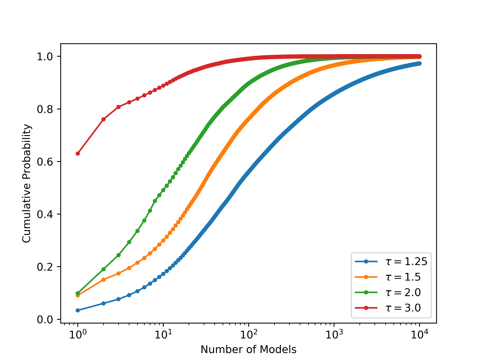
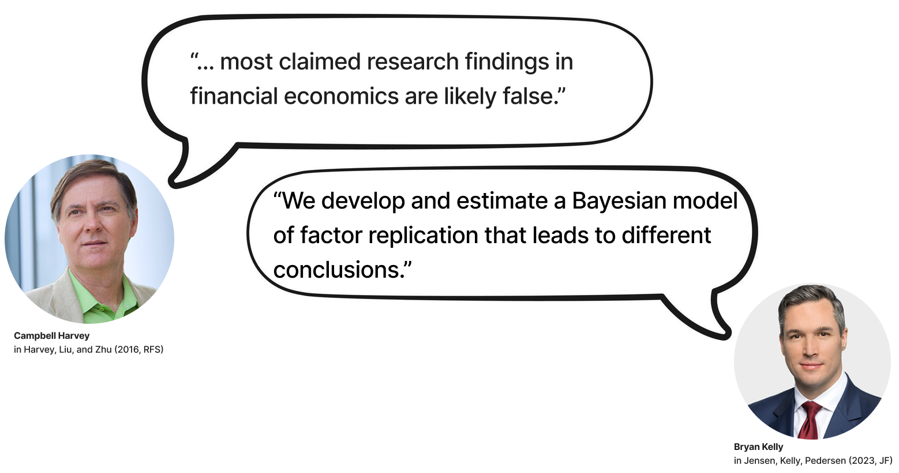
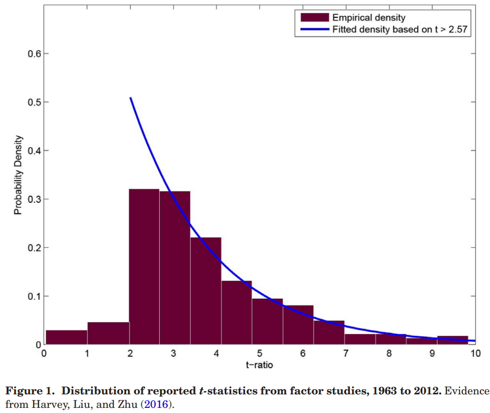
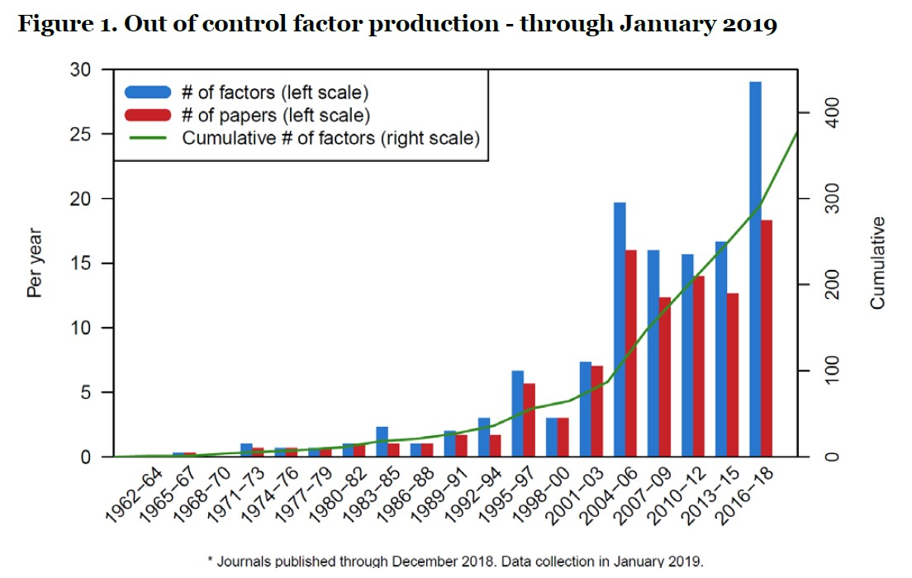
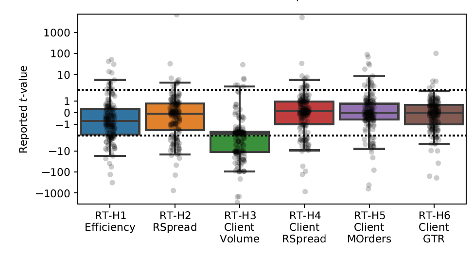
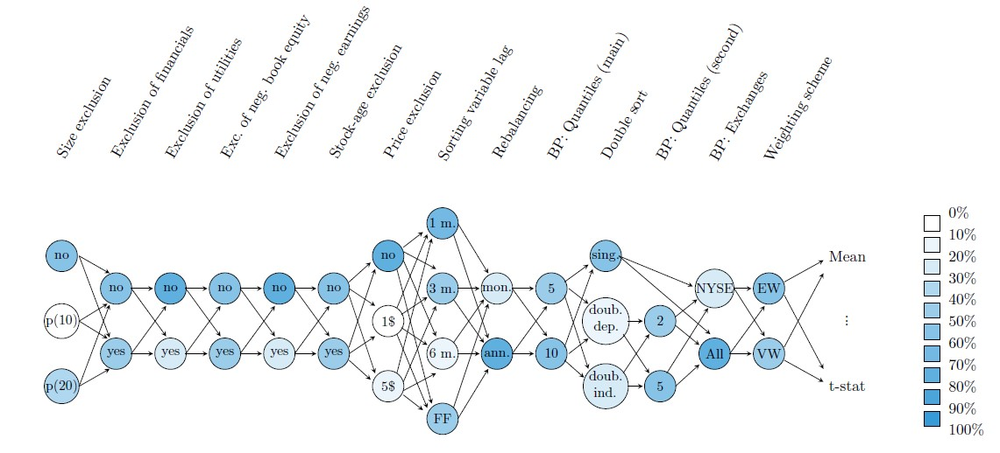
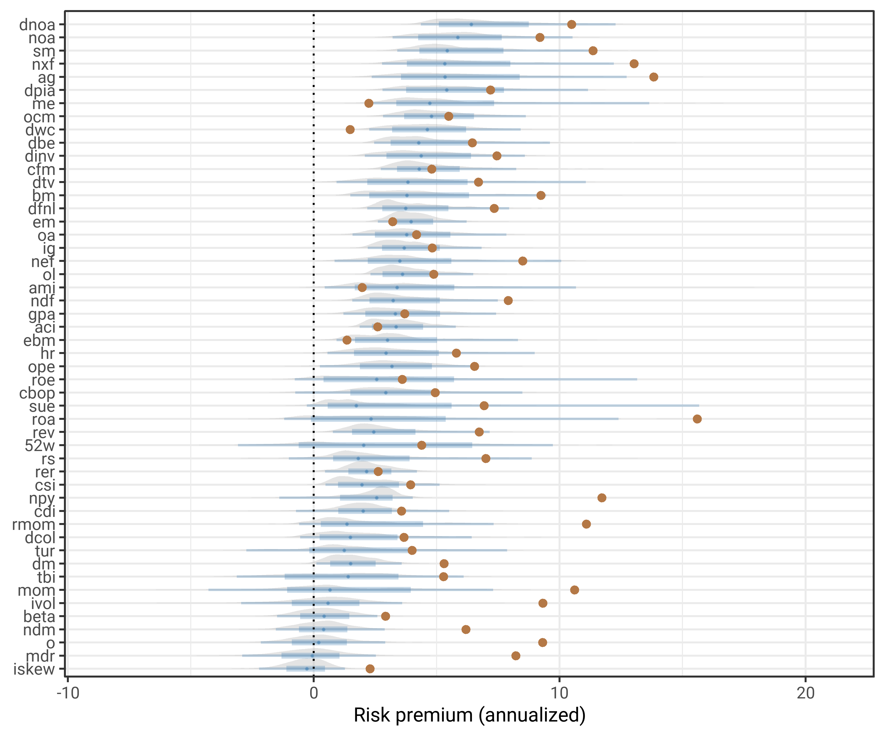
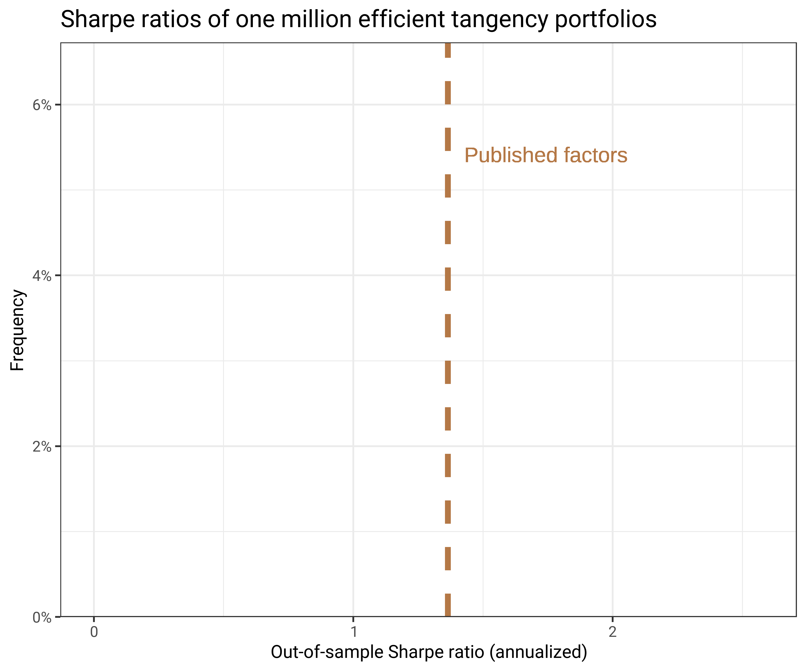
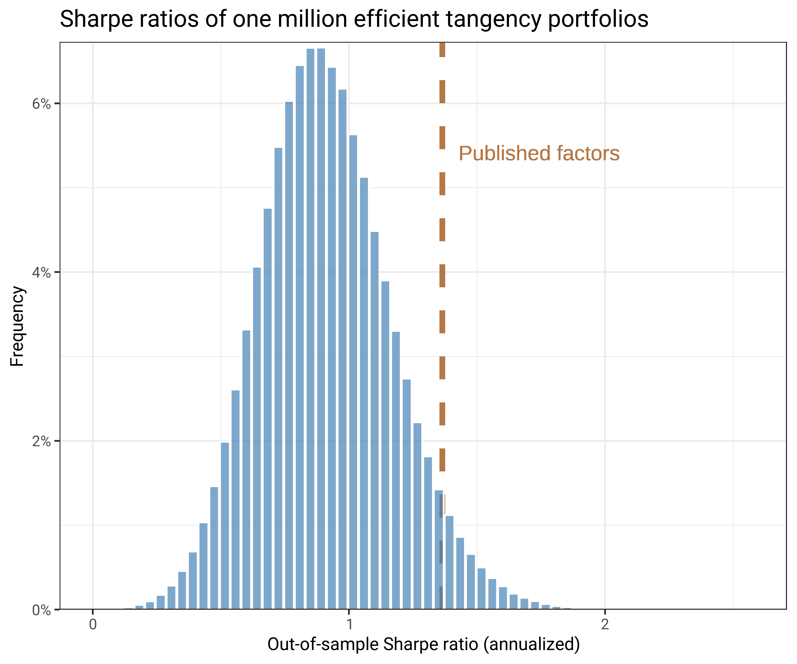
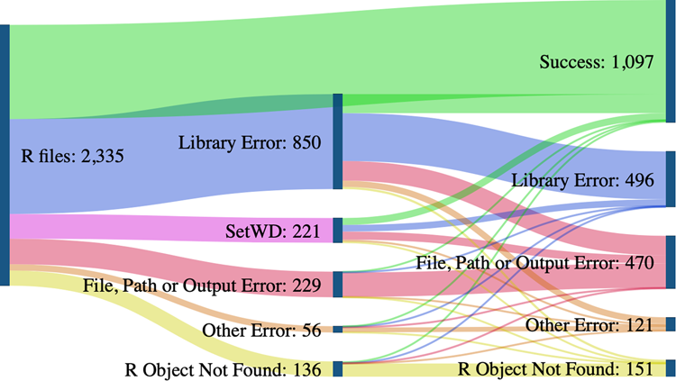

# Asset pricing models

## The fundamental equation

$$0 = E(m\,r)$$

- A linear SDF $m = a - b'f$ implies **beta pricing**: $E(r_i) = \beta_i'\lambda$,
  where $\beta_i = \text{Cov}(r_i, f)/\text{Var}(f)$ are factor loadings and
  $\lambda$ are factor risk premia

## Multifactor asset pricing models

- FF (1992, 1993) have shown that parts of the cross-sectional variation in expected returns can be captured using the following factors:

1. the return on the market portfolio in excess of the risk-free rate of return
2. a zero net investment (spread) portfolio long in small firm stocks and short in large firm stocks (SMB)
3. a spread portfolio long in high book-to-market stocks and short in low book-to-market stocks (HML)

- Basic CAPM risk-return trade-off: high risk comes along with a high expected return
- Conditional versions: risk and risk premium could vary with macro economy variables such as the default spread
- The Arbitrage Pricing Theory (APT) was introduced by Ross (1976) as an
alternative to the Capital Asset Pricing Model

## Market anomalies

| Anomaly | Finding | Key reference(s) |
|---|---|---|
| Betting against beta | $\alpha$ declining in $\beta$ across many asset classes | Frazzini & Pedersen (2014) |
| Size | Small stocks outperform large stocks | Banz (1981); FF (1992) |
| Value | High book-to-price stocks outperform growth stocks | Basu (1983); FF (1992) |
| Momentum | Intermediate-term winners outperform losers | Jegadeesh & Titman (1993); Carhart (1997) |
| Time-series momentum | Assets trending up (down) continue to do so | Moskowitz, Ooi & Pedersen (2012) |
| Liquidity | Illiquid stocks earn a return premium | Pastor & Stambaugh (2003) |

## Given these anomalies: Are markets efficient?

```{mermaid}
%%| echo: false
%%| fig-align: center
flowchart TD
    A[CAPM α ≠ 0] --> B(“A better factor model<br/>explains the premium”)
    A --> C[“Investor biases<br/>distort prices”]

```

- Cochrane (2011): any arbitrage-free data can be rationalized $0 = E_t(m_{t+1} r_{t+1})$ 
- but a model only gets its bite by restricting $m$ or distorted expectations, ideally tied to other data

## Arbitrage Pricing Theory

- APT assumes that markets are competitive and frictionless and that the return-generating process is
$$R_i = a_i + b_i' f + \varepsilon_i$$

where $R_i$ is the return for asset $i$, $a_i$ is the intercept of the factor model, $b_i$ is a $(K \times 1)$ vector of factor sensitivities (loadings) and $f$ is a $(K \times 1)$ vector of common factor realizations

- **Note:** $f$ is not necessarily a tradeable risk factor
- For the system of $N$ assets we have
$$R = a + Bf + \varepsilon$$

where $B$ is a $(N \times K)$ matrix of factor loadings and $\text{Cov}(\varepsilon) = \Sigma$

- Estimation is straightforward if the factors $f$ are tradeable portfolios

## APT (Ross, 1976)
- The absence of arbitrage implies 
$$
E(R) = \mu = \iota\lambda_0 + B\lambda_k
$$

where $\lambda_0$ is the zero-beta parameter (usually the risk-free rate) and $\lambda_k$ is the $(K \times 1)$ vector of risk premia. 
Then, the estimation rests on the regression 
$$
Z_t = a + BZ_{K,t} + \varepsilon_t
$$

where $Z_t$ are excess returns

- All the exact factor pricing models allow one to estimate the expected return on a given asset
- One needs measures of the factor sensitivity matrix $B$, the risk-free rate or the
zero-beta expected return, and the factor risk premia $\lambda_k$
- In the case where the factors are the excess returns on traded portfolios, the risk premia can be estimated directly from the sample means of the excess returns on the portfolios

## Open question: How to choose the factors?

**Considerations**

- Models may overfit the data because of data-snooping bias; in this case, they will not be able to predict
asset returns in the future (you can always add another factor to increase in-sample goodness of fit)
- Models may capture empirical regularities that are due to market inefficiency or investor irrationality; in this case, they may continue to fit the data but they will imply Sharpe ratios for factor portfolios that are too high to be consistent with a reasonable underlying model of market equilibrium

## Factor selection: Principal Components

- Well-known statistical procedure: Principal components
- Principal components is a technique to reduce the number of variables being studied
without losing too much information in the covariance matrix
- The principal components serve as the factors. The first principal component is the (normalized) linear combination of asset
returns with maximum variance
- Let the $(N \times 1)$ vector $x_1^*$ be the solution to
$$\max_{x_1} x_1'\hat\Omega x_1\quad{ s.t.}\quad x_1'x_1 = 1$$

where $\hat\Omega$ is the sample variance-covariance matrix of the returns 

- $x_1^*$ is the eigenvector associated with the largest eigenvalue of $\hat\Omega$
- For principal component $x_2^*$, solve the same optimization problem with the additional constraint that $x_2' x_1^* = 0$
- Partial least squares perform dimension reduction by directly exploiting covariation of predictors with the forecast target

## Factor selection: Theoretical approach

- Theoretical approach: identify variables that capture systematic economy-wide risks
  - *Macro variables*: interest rates, default spreads, inflation — proxies for systematic risk sources
  - *Firm characteristics*: size, book-to-market, momentum — proxies for differential risk exposure; sort stocks into portfolios accordingly
- For more information, consider Chapter 5 of "Econometrics of Financial Markets"

## Bayesian mindset: don't compromise on a single model

- Assess the probability that a candidate model generates the observed dynamics of asset returns
- Integrate over factor models weighted by their posterior probabilities 
- Approach follows directly from the Bayes rule: integrated factor model summarizes the uncertainties about the joint dynamics of stock returns

**"Integrating Factor Models", Avramov et al. (2023) and "Bayesian Solutions to the Factor Zoo", Bryzgalova et al. (2023)**

- Flexible to consider models with time-varying parameters 
- Prior beliefs about the entire parameter space are economically interpretable and weighted against model mispricing and the inclusion of macro predictors
- Posterior probability is weighted against deviations from the unconditional CAPM
- Penalize model complexity, i.e., an incremental factor, beyond the market, or macro predictor is retained only if it considerably improves model pricing abilities

## Integrating Factor Models

::::{.columns}

::: {.column width="60%"}
- Excess returns: multivariate asset pricing regression
$$r_{t+1} = \alpha(z_{t}) + \beta(z_{t})f_{t+1} + u_{r,t+1}, u_{r,t+1}\sim N\left (0,\Sigma_{RR}\right)$$

- Factors: multivariate predictive regression
$$f_{t+1} = \alpha_f + a_F z_t + u_{f,t+1}, u_{f,t+1}\sim N\left (0,\Sigma_{FF}\right)$$

- $r_{t+1}$: $N$-vector of excess returns
- $f_{t+1}$: $K$-vector of factors
- $z_t$: $M$-vector of macro predictors
- $\alpha(z_{t}) = \alpha_0 + \alpha_1 z_t$, fixed and time-varying mispricing
- $\beta(z_{t}) = \beta_0 + \beta_1\left(I_K \otimes z_t\right)$, fixed and time-varying factor loadings
- $a_F$ captures time-varying risk premia

:::

::: {.column width="40%"}

:::
::::

## From model proliferation to reproducibility

- The factor zoo raises a natural question: which findings are genuine?
- The remainder of this lecture examines why many published results fail to replicate — and what we can do about it

# The reproducibility crisis

## Reproducibility

- Research should be reproducible — enforcement becomes increasingly critical
- What does reproducible mean? Would you say your reports are reproducible?

**Collect ideas: Is empirical research in finance reproducible?**

- What are limiting factors? 
- What problems arise with non-reproducible research (in academia and finance)?

**Minimum requirements for reproducibility**

1. A set of files with the raw data and code. It is possible to create the tables and any data-derived charts/graphics/visualizations by running the code
1. Details about the system being used to run the analysis: operating system, patches, random number seeds (`set.seed(3010)`), and specific versions of all software/packages/libraries are listed
1. Open/transparent. All the data and materials are available (as opposed to "available upon request") -- e.g., posted on GitHub
1. Code is written in a way that can be readily understood 

## The replication crisis of finance

{width=90%}

## P-hacking: What is odd with this figure?

- Publication bias: reported $t$-stats of asset pricing *factors*

{width=50% fig-align="center"}

- Studies cluster just above the conventional significance thresholds (Harvey, 2017): the spike just above $t = 1.96$ and $t = 2.57$ is far larger than a smooth distribution would predict
- Notice very few papers reporting results below conventional significance levels

## The factor zoo

{width=50% fig-align="center"}

- Cochrane (2011): "Now we have a zoo of new factors"
- Do we really believe in 300+ risk factors?
- Machine learning's aim: tame the factor zoo
- See [this site](https://docs.google.com/spreadsheets/d/1mws1bU56ZAc8aK7Dvz696LknM0Vp4Rojc3n61q2-keY/edit#gid=0) for an updated sheet with published factors and some descriptions

## Related: Non-standard errors

- Large research project, led by Albert J. Menkveld ([Paper available here](https://papers.ssrn.com/sol3/papers.cfm?abstract_id=3961574))
- Uncertainty from the **evidence generating process** (EGP)
- EGP variation across researchers adds uncertainty: non-standard errors
- 164 teams test six hypotheses on the same sample

{width=70% fig-align="center"}

## Related: Non-standard errors

- Non-standard errors are sizeable, on par with standard errors
- Their size (i) co-varies only weakly with team merits, reproducibility, or peer rating, (ii) declines significantly after peer feedback, and (iii) is heavily underestimated by participants

{width=70% fig-align="center"}

## Non-standard errors in portfolio sorts
{width=90% fig-align="center"}

- Sample construction: exclusions based on market equity, industry, firm-months with negative book equity or negative earnings, stock-age or stock price
- Portfolio construction: lag of the sorting variables, portfolio rebalancing frequency, the number of portfolios, listing exchanges for breakpoints, weighting scheme
- Color saturation indicates how often the 109 papers analyzed by Hou et al. (2020) implemented each choice.

## Uncertainty everywhere



## Data preprocessing choices matter

:::: columns
::: {.column width="50%"}

#### A simple example

- Suppose the SDF is linear in the market and 50 other risky factors ($\color{red}f$ is fixed)
- Now: The *idea* of a risk factor remains the same, but the *data preprocessing choices* ($\color{red}{\mathcal{D}}$) vary
- We consider 3,840 plausible alternatives for portfolio sorts for *each* sorting variable
- Plethora of different ways to represent an otherwise identical SDF
- Data preprocessing choices alter the perceived efficient frontier and thus affect investment decisions
- Ignoring conceptual uncertainty implies a very strong prior

:::

::: {.column width="50%"}
:::: {.r-stack}
::: {.fragment}

:::
::: {.fragment .fade-in}

:::
::::
:::
::::

## Code & data sharing policies in top journals

{width=90%}

- **Code**: required for empirical work, simulations, numerical computations and experimental studies
- **Data**: if actual data cannot be shared (due to legal/confidentiality issues), authors must provide pseudo-data

## Reproducibility also important in industry

- **Transparency**: clear code & data practices build client & regulatory trust
- **Collaboration**: well-documented workflows enable smooth team handovers
- **Maintainability**: clean processes simplify updates & scaling
- **Faster Innovation**: reproducible processes accelerate testing & deployment

## How empirical projects sometimes feel
::::{.columns}

::: {.column width="50%"}


:::
::: {.column width="50%"}


:::
::::

## What can go wrong?

:::::{.columns}

::: {.column width="50%"}

**Key takeaways**

- Create a **separate project** for each data analysis
- Save & organize scripts with **descriptive names**
- Regularly **restart your session** to ensure all work is captured in scripts
- Always use **relative paths**, never absolute paths
- Avoid **manual steps** as much as possible

:::
::: {.column width="50%"}

{fig-align="center"}
:::
::::
